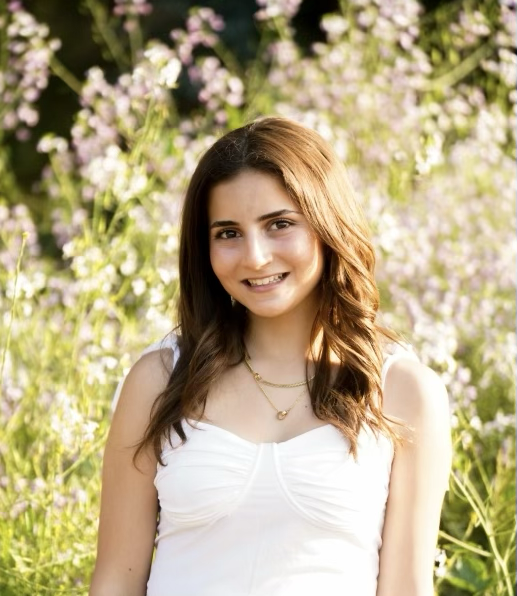
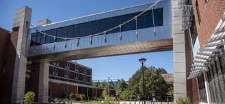
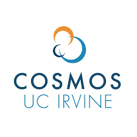

# Sarah Saadeh 
## My Personal Website

Welcome to my personal website! Here you can learn more about me and my interests.

## About Me

Hi! My name is Sarah Saadeh and I am a freshman at UC Berkeley studying Civil Engineering with an intended minor in Data Sceince. 

## Past Research

Check out some of my exciting projects:

1. **Civil Engineering Research Assistant**

   University of Illinois Urbana-Champaign
   Jun 2022 - Aug 2022 

Description: Research in plastic-enhanced asphalt binder. Working under Professor Al–Qadi, I analyzed graphs and data from rutting resistance and fatigue cracking tests. I was introduced to technical terminology, Python, and Spyder IDE, and conducted literature reviews on numerous published research papers.
 
   - 

2. **California State School of Mathematics and Science (COSMOS) Attendee**

   UC Irvine
   Jul 2021 - Aug 2021 

Description: Competitive admission. Research in Sustainable Civil Engineering Infrastructure. Group Collaboration with Final Project and Presentation. 4-week intensive program. Lectures on green-roof architecture, seismic design, zero-carbon, & algal biofuels. Self-designed experiment focused on bringing clean drinking water to developing countries using solar disinfection. Recorded and analyzed data from UV light meter & pH strip in Excel.
   
   - 

## Contact Me

Feel free to reach out to me via [email](sarahsaadeh@berkeley.edu) or connect with me on [LinkedIn](insert_linkedin_url_here).

---

###

Thank you for visiting my website! Stay tuned for more updates.

